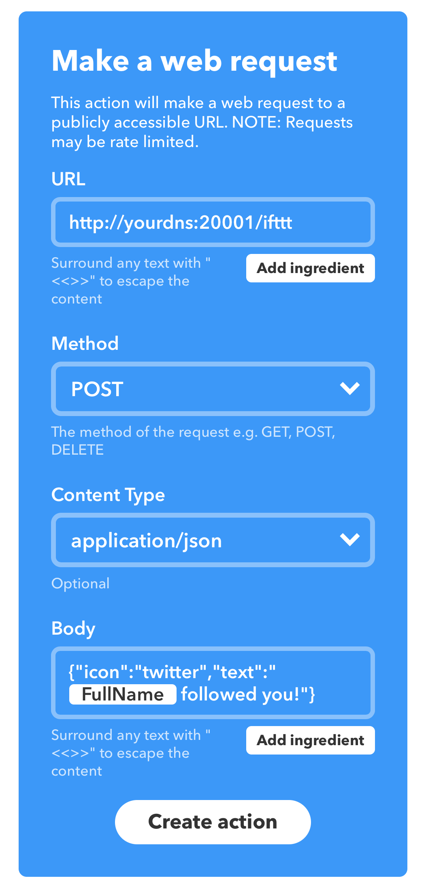
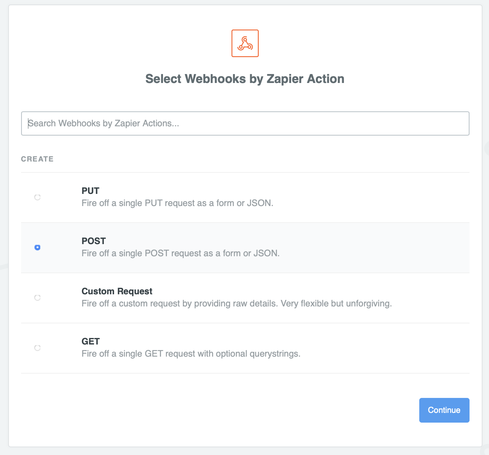
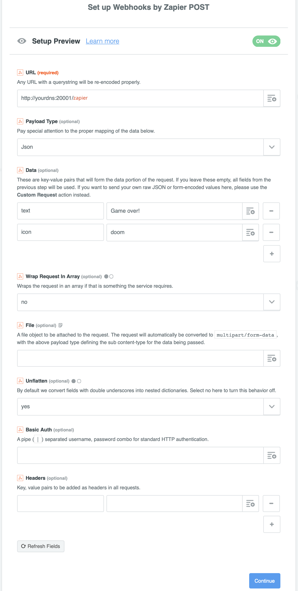

Lemon
-----

LED Monitor, for monitoring all sort of stuff and getting notified when something happens.


[More examples here.](https://github.com/mrusme/lemon/tree/master/docs)

## Requirements

- WiFi
- A Raspberry Pi with a [Pimoroni Unicorn Hat HD](https://shop.pimoroni.de/products/unicorn-hat-hd)
- Raspbian on its microSD card
- A GitHub account

## Installation

On your Raspberry:

```bash
$ raspi-config nonint do_spi 0
$ reboot
$ aptitude install python3 python3-pip python3-dev python3-spidev libtiff5-dev libjpeg-dev zlib1g-dev libfreetype6-dev liblcms2-dev libwebp-dev libharfbuzz-dev libfribidi-dev tcl8.6-dev tk8.6-dev python-tk
$ pip3 install gunicorn falcon pillow ujson unicornhathd
$ cd /opt
$ git clone https://github.com/mrusme/lemon.git
$ ln -s /opt/lemon/init.d/lemon /etc/init.d/lemon
$ update-rc.d lemon defaults
```

Lemon will now be run automatically every time your Raspberry starts.

## Running manually

```bash
$ cd lemon/
$ ./lemon.sh
```

## Configuration

### Port (on boot)

You can change the port by creating a file named `/etc/lemon` and adding the follwing content to it:

```bash
export PORT=1337
```

The init.d-script will look for the file and in case it was found source it.

### Port (manually)

```bash
PORT=1337 ./lemon.sh
```

## Integrations

### GitHub Webhooks

First, make Lemon's port (e.g. `20001`) accessible from the internet. You'll probably need to add a NAT rule to your firewall/router or fire up ngrok or something like that.
Then, set up hooks on the GitHub repos (`https://github.com/mrusme/<REPO>/settings/hooks`) or organisations (`https://github.com/organizations/<ORG>/settings/hooks`) that you'd like to receive notifications for. 
For the `Payload URL`, use `http://<YOUR-DNS-NAME>:<FORWARDED-PORT>/github`. As `Content type` use `application/json`. The secret is not necessary (yet). Also, configure the webhook to `Send me everything` and don't forget to check the `Active` checkbox.
That's it. You should be receiving notifications for at least a handful of implemented GitHub events.

### IFTTT

You can create all sort of notifications using [IFTTT's Maker Webhooks](https://ifttt.com/maker_webhooks). Configuration is pretty easy:

Build your IFTTT rule by specifying the `If this` service and using `Webhooks` as `then that` service. Configure the webhook like this:



### Zapier

Like with IFTTT, you can send webhooks from Zapier to Lemon - using the very same endpoint you use for IFTTT. Configuration for Zapier is pretty easy as well:

Build your Zapier zap and use `Webhooks` as an action. Configure the webhook like this:





## API

The body of the webhook should contain of the following JSON:

```json
{ 
  "icon": "icon-name-here",
  "text": "The text to be scrolled through after the icon animation finished"
}
```

You need to make sure that the icon name you specify actually exists within the `icons/` folder and is a `.png` file. If you want to use the icon `icons/docker.png`, simply specify `"icon": "docker"` in the JSON.

By default, each icon animation is being repeated three times. However, you can override that by specifying an additional JSON parameter named `icon_repeat`, e.g.:

```json
{ 
  "icon": "doom-bloody",
  "icon_repeat": 1,
  "text": "Game over!"
}
```

## Testing

```bash
curl -X "POST" "http://raspberrypi:20001/ifttt" \
     -H 'Content-Type: application/json; charset=utf-8' \
     -d $'{
  "icon": "youtube",
  "text": "New video on YouTube!"
}'
```

## Kudos to ...

- [@pimoroni](https://github.com/pimoroni) for their awesome hardware
- [@source-foundry](https://github.com/source-foundry) for [Hack](https://github.com/source-foundry/Hack), the best Termin/Editor font there has ever been
